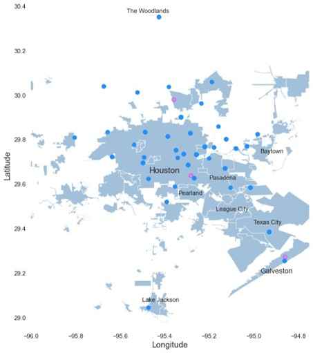
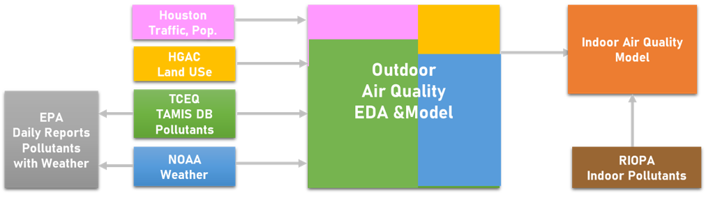
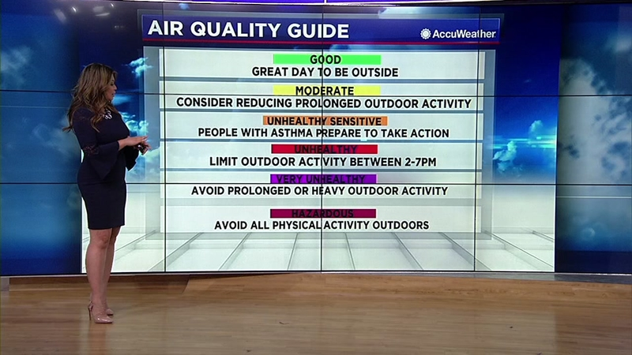
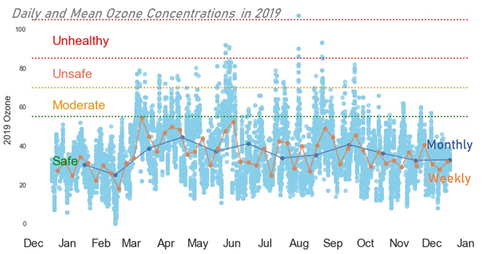
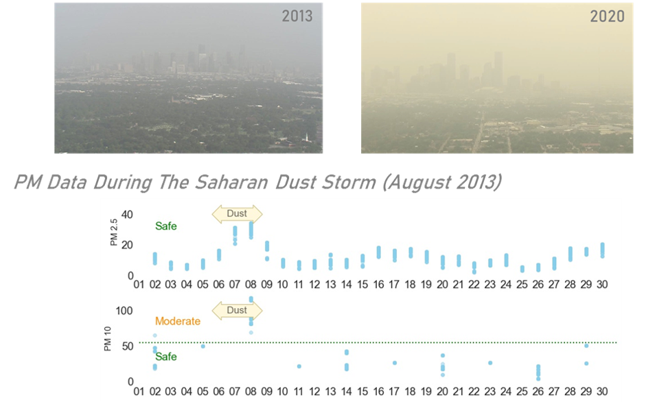
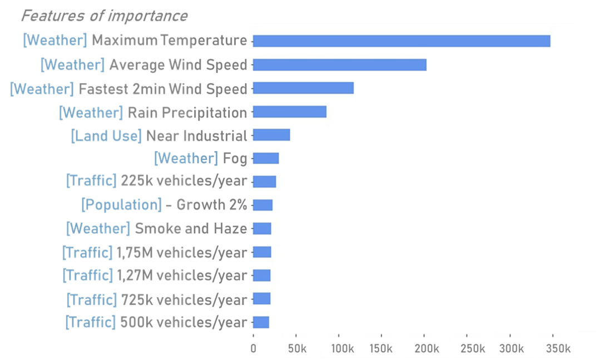

## THE STORY
Since 2008, there is an average of **129 Bad Air Days (BADs) each year in Houston**. During BADs, the Air Quality Index (AQI) labels may be “**moderate**”, **“unhealthy**”, and a few times a year “**very unhealthy**”. This project aims at **identifying drivers of air pollution** to enable the prediction of the outdoor air quality in Houston for decades to come in function of measurable factors. A secondary aspect of the project is to measure the impact of outdoor air quality on indoor air quality.

## THE HYPOTHESIS
**More people, more traffic, more pollution**
Houston’s **traffic ranked 8th** in the nation in 2020. To this daily pollution are added industrial emissions from refineries, plastic plants and other petro-chemical industries. Houston attracts an increasing number of workers (including the author of this report). According to the Houston-Galveston Area Council the **population** of Houston Metro will reach **9 millions in 2040**. 

## THE DATA
The data was collected from different sources:
* [Pollutant Concentrations: TCEQ’s Tamis DB (Texas Commission on Environmental Quality),](https://www.tceq.texas.gov/)
* [Weather Data: NOAA (National Oceanic and Atmospheric Administration),](https://www.noaa.gov/)
* [Pollutant and Weather Data: US EPA (Environmental Protection Agency),](https://www.epa.gov/)
* [Land Use: HGAC (Houston Galveston Area Council),](https://www.h-gac.com/Home)
* [Traffic and Population Data: City of Houston data website,](https://cohgis-mycity.opendata.arcgis.com/)
* [Indoor/Outdoor Data: RIOPA study (Relationship of Indoor, Outdoor, and Personal Air).](https://dataverse.harvard.edu/dataset.xhtml?persistentId=doi:10.7910/DVN/7UBE7P)

## DATA WRANGLING
The idea is to merge the data into a coherent data set by taking into account geographical locations, and by covering as much territory possible from The Woodlands to the North all the way down to Galveston to the Southeast on the coastline, including Baytown and Angleton (plants).

The main issues encountered during the wrangling of the data were matching sampling rates, connect local weather to each air quality station, deal with missing data, and integrate traffic count, land use  and population data to the data set.

## AIR QUALITY INDEX (AQI)
The **AQI** describes the **impact of pollution on the quality of life and daily activities**. When applied to ozone concentrations the effects are as described in the picture below. The AQI is calculated using pollutant concentrations. Check how the AQI is calculated in the US in the [report](./SpringboardCapstone2_HoustonAirQuality_Report_AnneWarren.pdf) or the [presentation](./Springboard_Capstone2_HoustonAirQuality_AnneWarren_2021.pdf) or in [wikipedia](https://en.wikipedia.org/wiki/Air_quality_index#United_States)

## EXPLORATORY DATA ANALYSIS (EDA) 
### Pollutants
The EDA shows that between 2008 and 2020 **Ozone** is the  problematic pollutant in Houston. The other pollutants remain in the “safe” zone and rarely go up to moderate if ever. Despite BADs, the weekly and monthly average ozone concentrations remain mostly in the “safe” zone.
There is an **average of 129 BADs per year** which may be as low as “Moderate” (80-110 days per year) up to “Very Unhealthy” (1 to 2 days per year). Ozone levels are lower in Winter and Spring.

### It looks bad but it is not BADs
Interestingly the EDA showed that severe weather, such as hurricanes and flooding, or special events, such as massive fires as bad as they look do not lead to BADs. A fun example is the Saharan Dust Storms which always make the news especially in August 6th-8th 2013 and in June 2020 when the dust haze is highly visible (see picture below). The particulate matter PM 10 barely reached “Moderate” while PM 2.5 remains in the safe zone.

During the pandemic, the'Stay Home' order during the Covid-19 outbreak (March 16th - April 30th 2020) helped ozone to reach very low levels in March until March 24th which was the day after the media announced that Judge Hidalgo would declare a “Stay at Home” order to replace the “Shelter in Place” order.

## MODEL AND METRICS
The model could be built focusing on ozone concentration values or AQI labels. In practice the dataset was too imbalanced to allow the detection of the rarer labels “Unhealthy” and “Very Unhealthy” by algorithms like Logistic Regression, SVM, KNN and XGB Classifier. Applying SMOTE to the dataset did not help the classification models because it forced the model to overfit the minority classes.  Linear and multi-linear regression do not fit the problem. SVR with RBF kernel was performing well with the training set but performed poorly with the testing test.  
**XGB Regressor** provided the best cross-validation results and hence was chosen as final model. The model was tuned using the following paremeters: reg:Squarrederror objective with gbtree booster, colsample_bytree and subsample set to 1, Eta at 1.3 and 20 for maxdepth.
**MAE** is the primary metric because the aim of the model is to show trends rather than predicting daily data. RMSE is used to keep an eye on the distance between daily data and predicted data. The metrics of the final model are: **MAE = 4.3 and RMSE = 6.2**.
The features of importance show that **maximum temperature**, **wind speed** and **daily precipitation** are the main drivers behind ozone concentrations in the air. Being  near an industrial zone seems to play a role thought minor. Population and traffic have little influence. The model shows that the hypothesis “More people, more traffic, more pollution” cannot be supported with the data. 

This outcome is not surprising because temperature is a catalyst in the formation of ozone. Regarding the wind, it may play a role of transportation, concentration or dispersion of ozone or of the chemicals leading its formation. The model can be used to see how this works in practice.
## MODEL APPLICATION
The model is used to see what would happen to ozone concentrations levels (low, average and BADs) when the major drivers increase or decrease. For this the degrees are added or removed from the maximum temperature while the wind speed and total precipitation are multiplied by a factor. **Temperature is a catalyzer** on all levels of ozone though. **High winds play a dual role** of dispersion on high level of ozone but tends to catalyze ozone formation in zones where ozone is low. **Rain** seems to have no influence by itself.
 Wind speed buffers temperature. High wind speeds tend to buffer the action of higher temperature which can be explained by the role of dispersion of the wind (i.e. dispersion of the ozone and also the dispersion of the chemicals involved in its formation). For instance, at the highest temperature (+15F) increasing the wind speed by 50% helps shifting the air quality from “Very Unhealthy” to “Unhealthy”.

## SUMMARY AND CONCLUSIONS
The most concerning pollutant in Houston is ozone. The hypothesis saying that more people in Houston would lead to more traffic and hence more pollution was wrong. The main driver of ozone pollution is the maximum outdoor temperature followed by wind speed.
The model is built to show trends as opposed to predict daily values. The MAE metric works for this purpose.
The model can help explore the influence of the drivers of ozone concentrations and  also how they can catalyze or buffer each other. The model also can be used to predict the number and intensity of BADs due to ozone.
Increasing maximum temperatures tend to increase ozone concentrations while increasing average and fastest wind act as a buffer. The wind seems to disperse the ozone or the chemicals leading to ozone.
There are many ways the model can be improved: 
* Traffic and population could be integrated differently,
* The surface and geographical frequency of land use could be added.
* VOCs emission could be added, which is part of the ozone formation equation.
* Industrial emission could be added, if available with geographical details.
* The imbalance of the AQI labels could be overcome using a Deep Learning model.

So much to do, So little time :wink:
