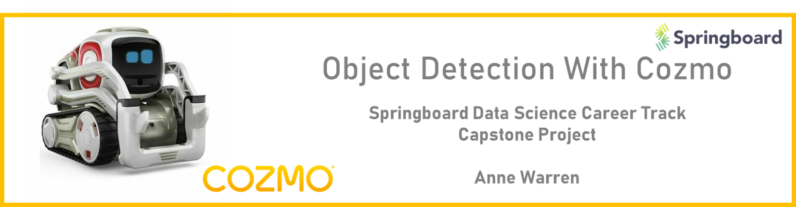
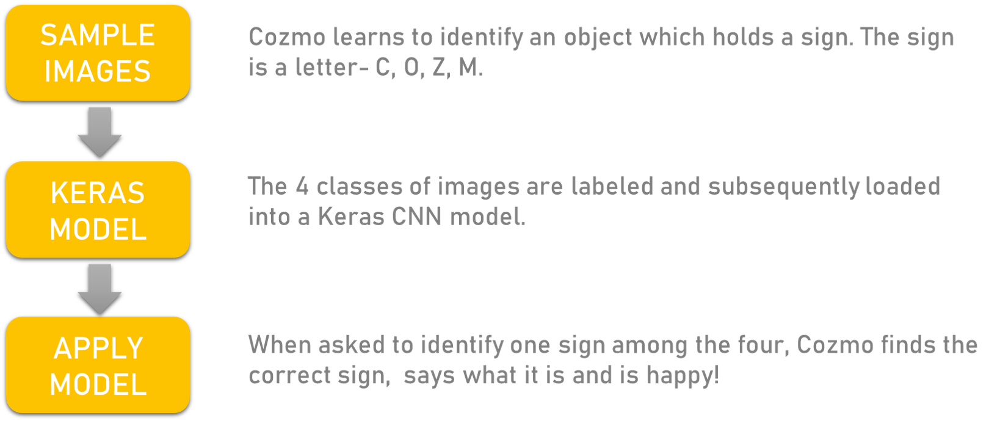
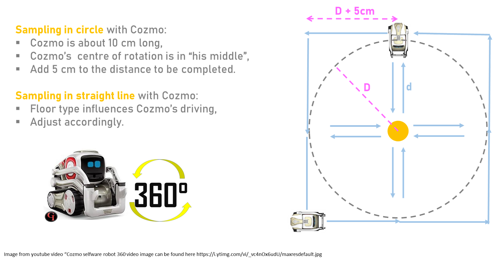
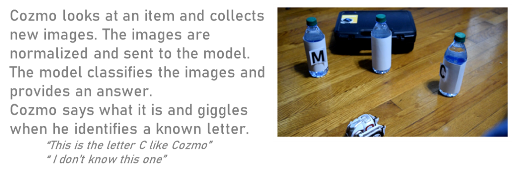

 

# Plan

 

# Sampling Strategy
 

 

 
#  Image Preparation and Selection

# Model and Metrics
The model was  trained on 4,646 images and validated with 2,795 images. The model is optimized by root mean square propagation (rmsprop)with a categorical cross-entropy loss function, amd a batch size of 30. The model without call backs reached an accuracy of 83% after 100 epochs while the model with the “ best callbacks” reached an accuracy of 77% after 100 epochs. The accuracy and loss curves suggest that the validation images are not representative and that both training and validation images should be shuffled. Additional images would be beneficial as well.

# Model Application

# Conclusion

