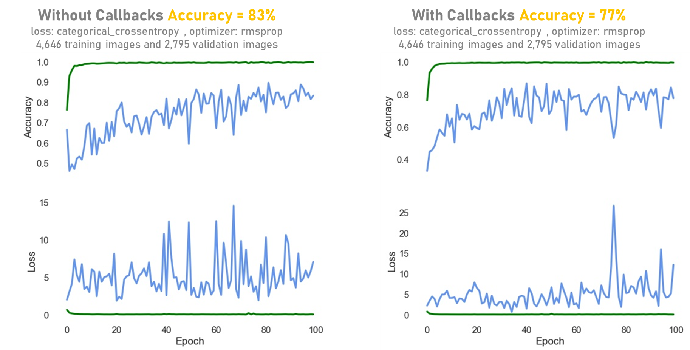

 
 
Watch this personalized intro from Cozmo (https://user-images.githubusercontent.com/68656802/116004638-41730a80-a5c9-11eb-9c07-291fdd2ff7bb.mp4)
 
 
Interested in learning more about Cozmo? See the developer website https://developer.anki.com/   and Cozmo by Digital Dream Lab https://www.digitaldreamlabs.com/pages/cozmo
 

# Plan

 

# Sampling Strategy

 
See the sampling (https://user-images.githubusercontent.com/68656802/116005996-feb43100-a5ce-11eb-9939-eed1f6c16300.mp4)

 

#  Image Preparation and Selection

# Model and Metrics
The model is a keras sequential model, optimized by root mean square propagation (rmsprop) with a categorical cross-entropy loss function, and a batch size of 30. The model without callbacks reached an accuracy of 83% after 100 epochs while the model with the “ best callbacks” reached an accuracy of 77% after 100 epochs. The accuracy and loss curves suggest that the validation images are not representative and that both training and validation images should be shuffled. After the shuffle the model reaches accuracy of 99.8%. The validation accuracy curve is better than the training curve because the model uses a dropout layer (50%).

# Model Application
Cozmo looks at an item and collects new images. The images are normalized and sent to the model. The model classifies the images and provides an answer. Cozmo says what it is and giggles when he identifies a known letter. 
See Cozmo identifies the letters https://user-images.githubusercontent.com/68656802/116006287-34a5e500-a5d0-11eb-9ae3-0532ad4bb0c6.mp4

# Conclusion
Simple Convolutional Neural Networks are relatively easy to build and make very powerful models for image classification and object detection.
 
The sequential model used in this project has good accuracy (>80%) but the accuracy curve shows that there is a need to shuffle the images between training and validation. Adding more images would be also beneficial.
 
As of now Cozmo just says the prediction of the model or “I don’t know this one” if the class is not known from the model yet. A confidence level using the model uncertainty and data uncertainty could be added to the program to prevent Cozmo from saying a wrong prediction.
